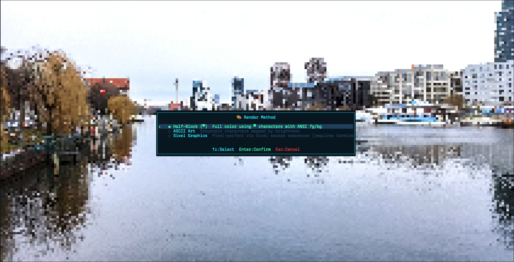

# bediz

A keyboard-driven terminal image viewer written in Rust, with ANSI half-block, ASCII, and Sixel rendering modes.



<br/>

[](https://github.com/Milad-HajiShafiei/bediz)

## Features

- Browse image files from an interactive terminal file picker.
- Open a directory or image directly from the command line.
- Render images using full-color half-block characters, tinted ASCII art, or Sixel graphics.
- Resize output to the available terminal area and cache rendered images.
- Navigate with arrow keys or `j`/`k`.

## Requirements

- Rust stable and Cargo.
- A terminal with true-color support for the default Half-block mode.
- A Sixel-capable terminal for Sixel mode.

## Install

### From source

```bash
cargo install --path .
```

This installs `bediz` into Cargo's binary directory, normally `~/.cargo/bin`.

### Build a release binary

```bash
cargo build --release
```

The binary is written to `target/release/bediz`.

## Usage

Open the current directory:

```bash
bediz
```

Open a directory:

```bash
bediz ~/Pictures
```

Open an image directly:

```bash
bediz ~/Pictures/photo.png
```

Supported formats include PNG, JPEG, GIF, BMP, WebP, TIFF, ICO, and QOI, subject to support provided by the `image` crate.

## Controls

### File picker

| Key | Action |
| --- | --- |
| `↑` / `↓`, `j` / `k` | Move through entries |
| `Home` / `End` | Jump to the first/last entry |
| `Page Up` / `Page Down` | Move by 20 entries |
| `Enter` | Open a directory or image |
| `q` / `Esc` | Quit |

Hidden entries are omitted. Directories are listed before image files.

### Image viewer

| Key | Action |
| --- | --- |
| `m` | Choose a rendering method |
| `b` | Return to the file picker |
| `q` / `Esc` | Quit |

In the rendering-method dialog, use `↑` / `↓` or `j` / `k`, then press `Enter` to confirm or `Esc` to cancel.

## Rendering modes

- **Half-block** is the default and works in most modern true-color terminals.
- **ASCII Art** uses brightness-based characters and applies a color tint from the source image.
- **Sixel** provides pixel-oriented output, but requires terminal emulator support. If Sixel output is unavailable, switch to Half-block with `m`.

## Development

Run the standard local checks:

```bash
cargo fmt -- --check
cargo check
cargo test
```

Build an optimized binary:

```bash
cargo build --release
```

## License

Licensed under the [MIT License](LICENSE).
